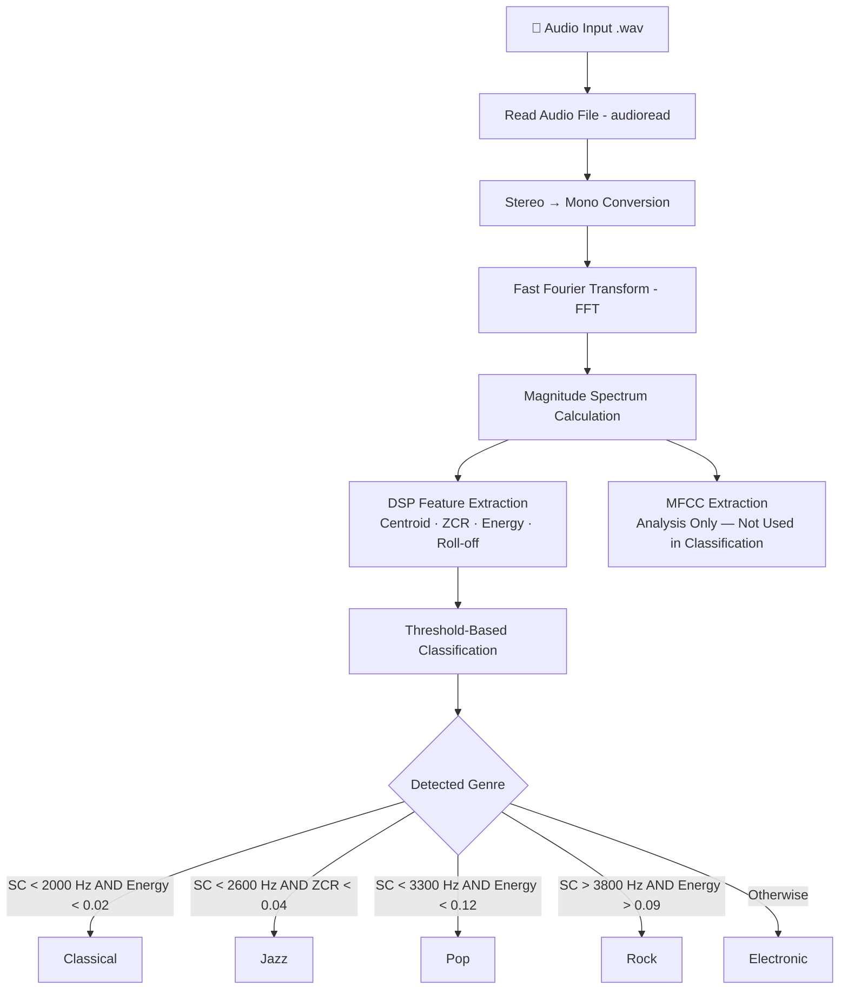

<div align="center">

# 🎵 Music Genre Classification
### Using Multiple Digital Signal Processing Features with MFCC Analysis

**Vellore Institute of Technology (VIT), Chennai**
*(Deemed to be University under Section 3 of UGC Act, 1956)*

**Mini Project — Signal Processing**

| Reg. No. | Name |
|---|---|
| 24BEL1023 | Nitish M A |
| 24BEL1059 | Lagsshin S |

**April 2026**

[](https://www.mathworks.com/products/matlab.html)
[](https://www.mathworks.com/products/signal.html)
[](https://www.mathworks.com/products/audio.html)
[](#license)

</div>

---

## Table of Contents

1. [Overview](#overview)
2. [Objectives](#objectives)
3. [Theory Summary](#theory-summary)
4. [Block Diagram](#block-diagram)
5. [Repository Structure](#repository-structure)
6. [Software & Tools](#software--tools)
7. [Getting Started](#getting-started)
8. [Placing the Audio Data](#placing-the-audio-data)
9. [Running the Pipeline](#running-the-pipeline)
10. [Running the Unit Tests](#running-the-unit-tests)
11. [Expected Output](#expected-output)
12. [Sample Results](#sample-results)
13. [Advantages](#advantages)
14. [Future Improvements](#future-improvements)
15. [Conclusion](#conclusion)
16. [Project Report](#project-report)
17. [License](#license)

---

## Overview

Music genre classification is an important application in audio signal processing and multimedia information retrieval. Different genres of music exhibit distinct characteristics in terms of frequency content, amplitude variation, and spectral structure.

This project implements a **rule-based (threshold) music genre classifier** in MATLAB that analyzes `.wav` audio files and sorts them into one of five genres — **Classical, Jazz, Pop, Rock, Electronic** — using four core DSP features:

- **Spectral Centroid**
- **Zero Crossing Rate (ZCR)**
- **Signal Energy**
- **Spectral Roll-off**

**Mel-Frequency Cepstral Coefficients (MFCC)** are also extracted for spectral analysis and visualization, but — matching the scope of the original project — they are **not** used in the classification decision itself.

This repository refactors the original monolithic script into a clean, modular, testable, production-style MATLAB project.

---

## Objectives

- Analyze audio signals using Digital Signal Processing techniques.
- Extract key features from music signals: spectral centroid, zero crossing rate, energy, and spectral roll-off.
- Convert audio signals from the time domain to the frequency domain using the Fast Fourier Transform (FFT).
- Classify different music genres based on the extracted DSP features.
- Visualize audio signals in both time-domain and frequency-domain representations.
- Compute MFCC features to observe the spectral characteristics of the audio signal.

---

## Theory Summary

| Concept | Description | Formula |
|---|---|---|
| **FFT** | Converts a time-domain signal into the frequency domain to reveal its frequency components. | `X(k) = FFT{x(n)}` |
| **Spectral Centroid** | The "center of gravity" of the frequency spectrum; indicates where signal energy is concentrated. Low = smoother sounds, High = brighter sounds. | `SC = Σ(f(k)·X(k)) / Σ(X(k))` |
| **Zero Crossing Rate (ZCR)** | Rate at which the signal changes sign; relates to noisiness / high-frequency content. | `ZCR = (1/2N) Σ \|sign(x(n)) − sign(x(n−1))\|` |
| **Signal Energy** | Average power of the signal, based on squared amplitude. | `Energy = (1/N) Σ x(n)²` |
| **Spectral Roll-off** | Frequency below which a given percentage (default 85%) of total spectral energy is contained. | `min f such that Σ_{k≤f} X(k) ≥ 0.85·Σ X(k)` |
| **MFCC** | Mel-scale cepstral coefficients that mimic human auditory perception; used here for analysis only. | Pre-emphasis → Framing → Hamming Window → FFT → Mel Filter Bank → Log Energy → DCT |

**Genre — frequency-characteristic intuition:**

| Genre | Typical Frequency Characteristics |
|---|---|
| Classical | More low-frequency components |
| Jazz | Balanced frequencies |
| Pop | Moderate high frequencies |
| Rock | Strong high-frequency guitar sounds |
| Electronic | Bright, synthesized sounds |

---

## Block Diagram



---

## Repository Structure

```
music-genre-classification-dsp/
├── +features/                     # DSP & MFCC feature-extraction package
│   ├── spectral_centroid.m        # Spectral centroid (Hz)
│   ├── zero_crossing_rate.m       # Zero crossing rate
│   ├── signal_energy.m            # Average signal energy
│   ├── spectral_rolloff.m         # 85% energy roll-off frequency
│   └── extract_mfcc.m             # MFCC coefficients (analysis only)
│
├── +utils/                        # Reusable helper package
│   ├── preprocess_audio.m         # audioread + stereo→mono conversion
│   ├── compute_fft.m              # FFT + single-sided magnitude spectrum
│   └── plot_results.m             # 4-panel diagnostic visualization
│
├── classify_genre.m               # Rule-based threshold decision logic
├── main.m                         # Pipeline entry point (orchestrator)
├── run_tests.m                    # Convenience script to run all unit tests
│
├── data/
│   ├── raw/                       # 👉 Place input .wav files here
│   │   └── .gitkeep
│   └── processed/                 # (optional) intermediate/cached audio
│       └── .gitkeep
│
├── results/
│   ├── figures/                   # Auto-generated PNG plots per file
│   │   └── .gitkeep
│   ├── logs/
│   │   └── .gitkeep
│   └── classification_summary.csv # Auto-generated after running main.m
│
├── tests/                         # MATLAB Unit Testing Framework suite
│   ├── TestSpectralCentroid.m
│   ├── TestZeroCrossingRate.m
│   ├── TestSignalEnergy.m
│   ├── TestSpectralRolloff.m
│   └── TestClassifyGenre.m
│
├── docs/
│   └── report/
│       └── Music_Genre_Classification_Report.docx   # Full mini-project report
│
├── .gitignore
└── README.md
```

> MATLAB **package folders** (prefixed with `+`) namespace the feature and utility functions, so they are called as `features.spectral_centroid(...)` and `utils.preprocess_audio(...)` — no risk of clashing with MATLAB built-ins or other projects on the path.

---

## Software & Tools

| Software / Tool | Purpose |
|---|---|
| MATLAB (R2021b or later recommended) | Implementation of DSP algorithms |
| Signal Processing Toolbox | FFT-based spectral analysis |
| Audio Toolbox | `audioread`, `mfcc` |
| WAV Audio Files | Input music signals |
| Git | Version control |

---

## Getting Started

1. **Clone or download** this repository.
2. Open MATLAB and set the repository root as your **Current Folder** (or run `addpath` on it). Because every script resolves paths relative to `fileparts(mfilename('fullpath'))`, no hardcoded absolute paths are required.
3. Confirm the Signal Processing and Audio Toolboxes are installed:
   ```matlab
   ver
   ```
   Look for `Signal Processing Toolbox` and `Audio Toolbox` in the list.

---

## Placing the Audio Data

Place your `.wav` sample files inside:

```
data/raw/
```

By default, `main.m` looks for these five files (edit the `files` cell array in `main.m` to use your own filenames):

```matlab
files = {'classical1.wav', 'pop3.wav', 'rock4.wav', 'jazz1.wav', 'electronic4.wav'};
```

> `.wav` files are **excluded from version control** via `.gitignore` (audio datasets are large binary assets). Only the folder structure is preserved via `.gitkeep` placeholders — you must supply your own audio samples locally.

If a listed file is missing, `main.m` prints a warning and **skips it** rather than crashing the whole pipeline.

---

## Running the Pipeline

From the MATLAB Command Window, with the repository root as the current folder:

```matlab
main
```

This will:

1. Read and preprocess each `.wav` file (`utils.preprocess_audio`).
2. Compute the FFT-based magnitude spectrum (`utils.compute_fft`).
3. Extract DSP features (`features.spectral_centroid`, `features.zero_crossing_rate`, `features.signal_energy`, `features.spectral_rolloff`).
4. Extract MFCC coefficients for analysis (`features.extract_mfcc`).
5. Classify the genre (`classify_genre`).
6. Print a per-file report to the command window.
7. Save a 4-panel diagnostic figure per file to `results/figures/`.
8. Write a summary table to `results/classification_summary.csv`.

---

## Running the Unit Tests

A MATLAB Unit Testing Framework suite lives in `tests/`, covering every feature-extraction function plus the classification logic.

```matlab
run_tests
```

Or, using the framework directly:

```matlab
results = runtests('tests');
disp(results)
```

All tests are self-contained (synthetic signals with known analytical answers) — **no audio files are required** to run the test suite.

---

## Expected Output

Console output follows this format for each processed file:

```
File: classical1.wav
Spectral Centroid: 849.83 Hz
ZCR: 0.0231
Energy: 0.0031
Spectral Roll-off: 1324.72 Hz
MFCC Mean Value: -0.79
Detected Genre: Classical
```

Each file also produces a saved figure (`results/figures/<filename>_analysis.png`) containing four panels:

| Panel | Content |
|---|---|
| Top-left | Time-domain waveform (amplitude vs. sample index) |
| Top-right | Frequency spectrum (magnitude vs. frequency) |
| Bottom-left | Bar chart comparing Centroid / ZCR / Energy / Roll-off |
| Bottom-right | MFCC feature map — coefficient heat map across frames |

---

## Sample Results

Reference values reproduced from the original project run (see [full report](#project-report) for plots):

| File | Spectral Centroid (Hz) | ZCR | Energy | Roll-off (Hz) | MFCC Mean | Detected Genre |
|---|---|---|---|---|---|---|
| classical1.wav | 849.83 | 0.0231 | 0.0031 | 1324.72 | -0.79 | **Classical** |
| pop3.wav | 2855.29 | 0.0292 | 0.0918 | 6596.83 | -0.14 | **Pop** |
| rock4.wav | 4309.86 | 0.0623 | 0.1027 | 9434.90 | 0.09 | **Rock** |
| jazz1.wav | 2291.63 | 0.0282 | 0.0230 | 5259.54 | -0.24 | **Jazz** |
| electronic4.wav | 3565.32 | 0.0336 | 0.0879 | 7847.23 | -0.11 | **Electronic** |

All five files were classified correctly by the threshold rules in `classify_genre.m`, and these exact values are used as regression cases in `tests/TestClassifyGenre.m`.

---

## Advantages

- Simple and easy to implement.
- Uses multiple DSP features for more informed classification than any single metric alone.
- Provides visualization of both time-domain and frequency-domain signals.
- Helps build practical understanding of DSP applications in audio processing.
- Modular package structure makes each feature independently testable and reusable.

## Future Improvements

- Incorporate more audio features (e.g. spectral flux, chroma, tempo) for improved classification accuracy.
- Use larger, more diverse audio datasets for more reliable and generalizable results.
- Implement frame-based (short-time) processing for finer-grained temporal analysis.
- Integrate MFCC coefficients — or other features — into a trained ML classifier (e.g. SVM, k-NN, neural network) instead of fixed thresholds.
- Add continuous integration (CI) to automatically run `tests/` on every commit.

---

## Conclusion

This project demonstrates the application of Digital Signal Processing techniques for music genre classification. Multiple DSP features — spectral centroid, zero crossing rate, energy, spectral roll-off, and MFCC — are extracted from audio signals to analyze their characteristics. These features provide insight into the spectral structure and frequency distribution of music signals. The MATLAB implementation successfully analyzes audio files, extracts relevant features, and classifies music genres using rule-based decision logic, offering a practical, hands-on understanding of audio signal analysis and feature extraction using DSP techniques.

---

## Project Report

The full academic mini-project report — including the introduction, objectives, theory, block diagram, MATLAB implementation listing, results, advantages, improvements, and conclusion — is available at:

📄 [`docs/report/Music_Genre_Classification_Report.docx`](docs/report/Music_Genre_Classification_Report.docx)

---

## License

This academic project is released under the MIT License — see below.

```
MIT License

Copyright (c) 2026 Nitish M A, Lagsshin S

Permission is hereby granted, free of charge, to any person obtaining a copy
of this software and associated documentation files (the "Software"), to deal
in the Software without restriction, including without limitation the rights
to use, copy, modify, merge, publish, distribute, sublicense, and/or sell
copies of the Software, and to permit persons to whom the Software is
furnished to do so, subject to the following conditions:

The above copyright notice and this permission notice shall be included in all
copies or substantial portions of the Software.

THE SOFTWARE IS PROVIDED "AS IS", WITHOUT WARRANTY OF ANY KIND, EXPRESS OR
IMPLIED, INCLUDING BUT NOT LIMITED TO THE WARRANTIES OF MERCHANTABILITY,
FITNESS FOR A PARTICULAR PURPOSE AND NONINFRINGEMENT. IN NO EVENT SHALL THE
AUTHORS OR COPYRIGHT HOLDERS BE LIABLE FOR ANY CLAIM, DAMAGES OR OTHER
LIABILITY, WHETHER IN AN ACTION OF CONTRACT, TORT OR OTHERWISE, ARISING FROM,
OUT OF OR IN CONNECTION WITH THE SOFTWARE OR THE USE OR OTHER DEALINGS IN THE
SOFTWARE.
```

---

<div align="center">

**Nitish M A** (24BEL1023) · **Lagsshin S** (24BEL1059)
VIT Chennai · Signal Processing Mini Project · April 2026

</div>
